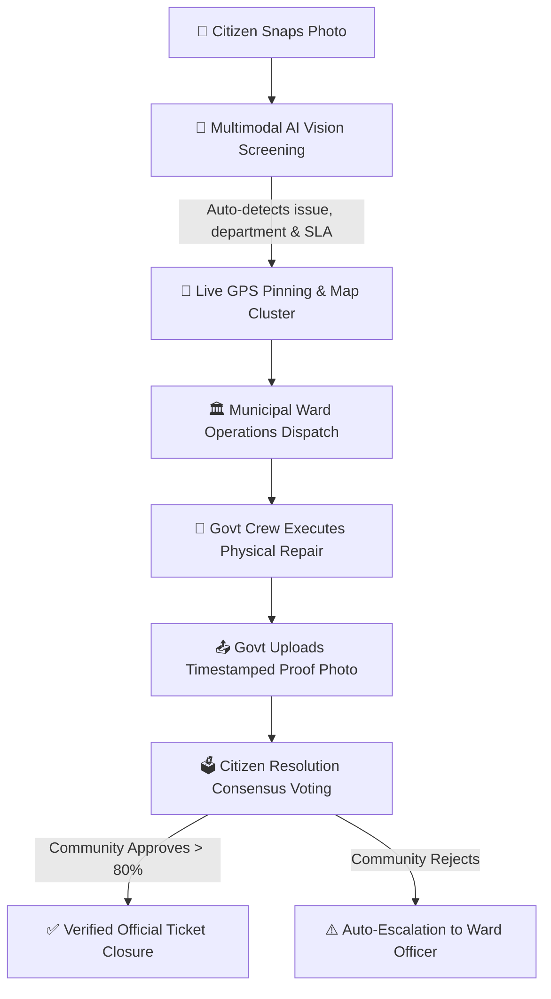

# MarkPoint 📍 — AI-Powered Civic Action & Resolution Platform

[](https://heer-18.github.io/MarkPoint/)
[](MarkPoint.apk)
[](LICENSE)
[](https://reactjs.org/)
[](https://capacitorjs.com/)
[](https://tailwindcss.com/)

> **MarkPoint** empowers citizens and municipal corporations with an AI-driven, transparent civic resolution pipeline. Report municipal hazards with one snap, track repairs in real-time on live GIS maps, and enforce democratic accountability through citizen consensus voting before tickets are officially closed.

---

## 🌐 Live Web Application & Android App

| Platform | Access Link | Description |
| :--- | :--- | :--- |
| **🌐 Live Web App** | [**https://heer-18.github.io/MarkPoint/**](https://heer-18.github.io/MarkPoint/) | Fully responsive PWA accessible on any phone or desktop browser. |
| **📱 Android APK** | [**Download MarkPoint.apk**](MarkPoint.apk) | Native Android package (4.8 MB) with offline storage, camera integration, and haptic feedback. |
| **📂 Source Code** | [**Heer-18/MarkPoint**](https://github.com/Heer-18/MarkPoint) | Official GitHub repository. |

---

## 🛑 Problem Statement

Municipal governance in rapidly growing urban centers faces several critical bottlenecks:

1. **High Friction Reporting**: Citizens struggle with convoluted multi-page government portals requiring complex taxonomy classification, department selection, and bureaucratic forms.
2. **Ghost Resolutions**: Municipal tickets are frequently marked as "Resolved" in internal portals without genuine on-ground physical repair or citizen verification.
3. **Lack of Transparent Evidence**: Citizens cannot verify if a reported pothole, open manhole, or garbage dump was fixed properly or merely patched over temporarily.
4. **Siloed Geo-Telemetry**: Lack of unified, live geographic heatmaps for city administrators to prioritize high-density hazard zones and track ward-level SLA compliance.

---

## 💡 Our Solution: MarkPoint Architecture

MarkPoint creates a closed-loop, verifiable civic management lifecycle:



### 1. Zero-Form AI Computer Vision Screening
- **Single-Snap Submission**: Citizens simply upload an image (with optional voice note).
- **Multimodal AI Analysis**: Analyzes the image using Google Gemini Vision / Edge CV to automatically detect:
  - Hazard Category (e.g., Deep Potholes, Overflowing Dumpsters, Open Manholes, Waterlogging).
  - Responsible Department (PWD, Solid Waste Management, Water Supply & Sewerage).
  - Hazard Severity & SLA Window (e.g., Urgent 24h, Critical 48h, Standard 72h).
  - Drafts an official, formatted municipal grievance memo automatically.

### 2. Live Geo-Spatial Map & City Telemetry
- Real-time interactive Leaflet GIS map with custom pin clustering.
- City-specific parameter filters (Surat, Nadiad, Ahmedabad, Vadodara, Rajkot, etc.).
- Live status indicators: **Active Issues**, **Under Govt Repair**, and **Community-Verified Resolved**.

### 3. Democratic "Proof-of-Work" Citizen Consensus Voting
- Only municipal field crews have the authority to submit official repair photos after physical execution.
- Citizens receive a voting audit modal displaying side-by-side **Before vs After** imagery with an interactive slider.
- Tickets are only stamped **"Resolved"** once local citizens cast their consensus vote confirming the repair.

### 4. Civic Karma & Gamification
- Citizens earn civic trust points and karma badges for verified reports and accurate community audit voting.
- Community leaderboard recognizes active citizen watchdogs.

---

## 📋 Civic Taxonomy & SLA Framework

| Category Code | Hazard Name | Responsible Department | Priority | Default SLA |
| :--- | :--- | :--- | :--- | :--- |
| **RD-01** | Deep Potholes & Road Cavities | Public Works Department (PWD) | URGENT | 48 Hours |
| **RD-03** | Open / Damaged Manhole | Drainage & Sewerage Board | CRITICAL | 24 Hours |
| **RD-05** | Urban Waterlogging & Drain Clog | Stormwater Drainage Division | HIGH | 36 Hours |
| **SW-01** | Open Garbage Dump & Litter | Solid Waste Management (SWM) | HIGH | 24 Hours |
| **SW-02** | Overflowing Public Dumpster | Ward Sanitation Operations | MEDIUM | 48 Hours |
| **WB-02** | River / Canal Chemical Effluent | Pollution Control & Ecology | CRITICAL | 24 Hours |
| **PA-01** | Fallen Trees & Damaged Assets | Parks & Public Amenities | MEDIUM | 72 Hours |

---

## 📱 How to Install the Android App

### Direct APK Installation (Recommended)
1. Download the [**MarkPoint.apk**](MarkPoint.apk) directly from this repository to your Android smartphone.
2. Tap the downloaded file in your notification panel or File Manager.
3. If prompted:
   - Tap **Settings** -> Enable **"Allow from this source"** (or *Install Unknown Apps*).
4. Tap **Install** and open **MarkPoint** from your app drawer.

---

## 💻 Local Development & Build Guide

### Prerequisites
- **Node.js**: Version 18.x or 20.x ([Download](https://nodejs.org/))
- **npm**: Version 9.x or higher
- **Android Studio / JDK 21** *(Optional, for native Android builds)*

### Step 1: Clone Repository
```bash
git clone https://github.com/Heer-18/MarkPoint.git
cd MarkPoint
```

### Step 2: Install Dependencies
```bash
npm install
```

### Step 3: Run Local Dev Server
```bash
npm run dev
```
Open your browser and navigate to `http://localhost:5173`.

### Step 4: Build for Production (Web)
```bash
npm run build
```
The static bundle will be compiled into the `dist/` directory.

### Step 5: Sync & Build Native Android APK
```bash
# Sync web bundle into native Android project
npx cap sync android

# Compile Android APK using Gradle
cd android
./gradlew assembleDebug
```
The generated APK will be at `android/app/build/outputs/apk/debug/app-debug.apk`.

---

## 🛠️ Technology Stack

- **Frontend Core**: React 18, TypeScript, Vite
- **Styling & Motion**: TailwindCSS, Framer Motion, Lenis Smooth Scroll
- **Mapping & GIS**: Leaflet, OpenStreetMap, HTML5 Geolocation API
- **AI & Multimodal**: Google Gemini Vision API, Edge Computer Vision Classification Engine
- **Mobile Native Runtime**: Capacitor 8.5 (Android Web View Bridge, Camera Plugin, Haptics)
- **Icons & UI Assets**: Lucide React, Custom SVG Design System
- **CI/CD Deployment**: GitHub Actions & GitHub Pages

---

## 👥 Authors & Acknowledgments

- **Lead Developer**: [Heer-18](https://github.com/Heer-18)
- Developed for **HackDay Civic Innovation Hackathon**.

---

## 📄 License

This project is licensed under the **MIT License** — feel free to use, modify, and distribute for municipal and community open-source initiatives.
